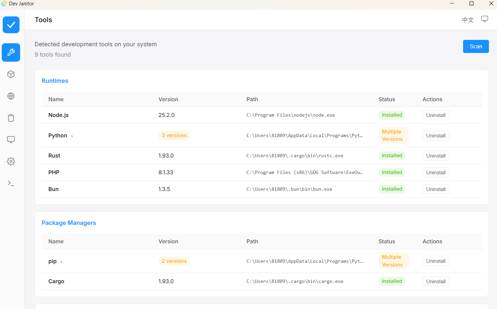
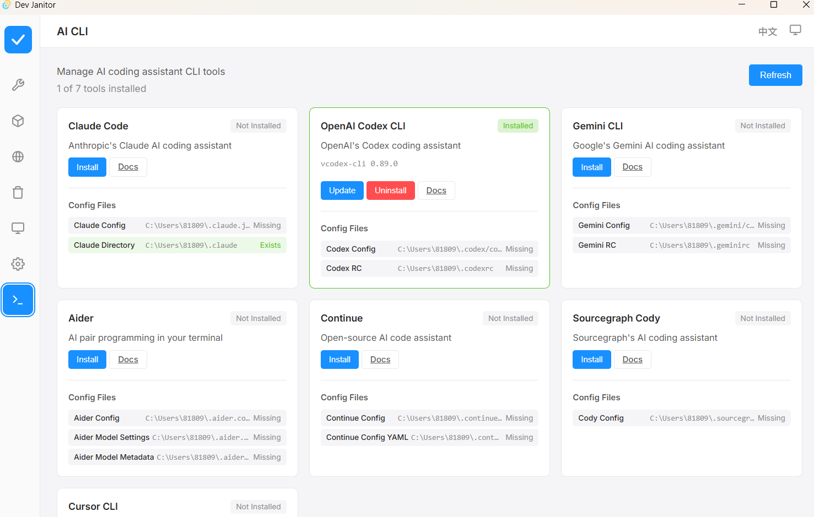
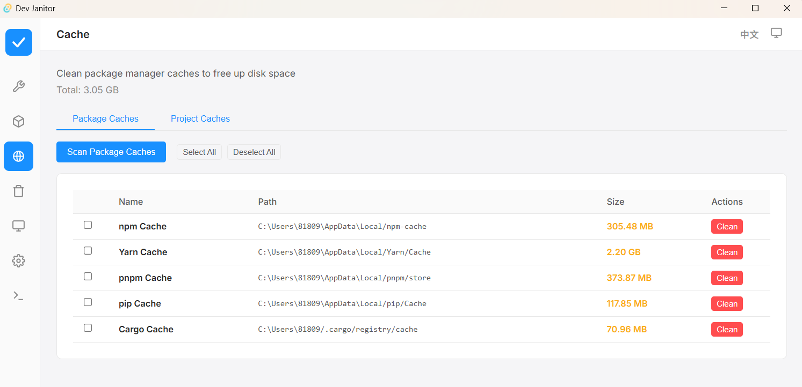
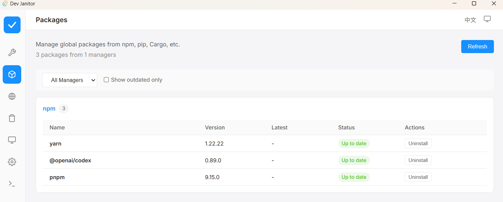

# Dev Janitor v2 🧹

<div align="center">


[](https://github.com/cocojojo5213/dev-janitor/actions)
[](https://github.com/cocojojo5213/dev-janitor/releases)
[](https://github.com/cocojojo5213/dev-janitor/releases)
[](LICENSE)

**让您的开发环境始终保持闪亮如新 ✨**

[下载安装](#-安装) • [功能特特性](#-功能特性) • [软件截图](#-软件截图) • [参与贡献](#-参与贡献) • [English](README.md)

</div>

---

## 🚀 为什么选择 Dev Janitor?

开发者热爱创造，但我们讨厌身后留下的混乱。`node_modules` 黑洞、构建产生的 `target` 文件夹、不再使用的 Docker 容器、AI 工具遗留的临时文件……它们正在吞噬您的磁盘空间，拖慢您的系统速度。

**Dev Janitor** 是您的私人机器人管家，它能智能识别并清理这些开发垃圾，为您瞬间回收数 GB 的空间，让您的机器运行如飞。

## ✨ 功能特性

### 🧹 智能清理
- **深度扫描**: 使用智能算法发现隐藏在项目深处的垃圾文件。
- **AI 残留清理**: 专门检测 AI 编程工具（如 Aider, Cursor, Copilot）产生的工件和缓存。
- **安全模式**: 白名单保护机制，确保永远不会误删您的重要文件。

### 🛠️ 工具管理
- **一站式管理**: 统一管理 Node, Python, Rust, Go 等各种语言环境的全局工具。
- **版本控制**: 轻松查看版本信息，一键更新过时的全局包。
- **AI CLI 市场**: 支持一键安装和管理 Claude Code, Codex, Aider 等热门 AI 命令行工具。

### 📊 系统健康
- **进程杀手**: 快速识别并终结占用大量资源的开发进程。
- **端口扫描**: 一眼看穿是谁占用了 3000 或 8080 端口，并一键释放。
- **环境医生**: 自动分析您的 PATH 环境变量和 Shell 配置文件，发现潜在错误和冲突。

## 📸 软件截图

<div align="center">
  
  <p><em>一站式管理所有开发工具</em></p>
</div>

<br/>

<div align="center">
  
  <p><em>一键扫描并清理 AI 工具残留文件</em></p>
</div>

<br/>

<div align="center">
  
  <p><em>释放包管理器缓存占用的数 GB 空间</em></p>
</div>

<br/>

<div align="center">
  
  <p><em>监控和管理开发进程与端口占用</em></p>
</div>


## 📥 安装

### Windows
从 [Releases](https://github.com/cocojojo5213/dev-janitor/releases) 页面下载最新的 `.msi` 安装包。

### MacOS
从 [Releases](https://github.com/cocojojo5213/dev-janitor/releases) 下载 `.dmg` 文件。
> *注意: 因签名原因，首次运行可能需要 右键 > 打开 来绕过 Gatekeeper。*

### Linux
我们提供 AppImage, .deb, 和 .rpm 格式。请前往 [Releases](https://github.com/cocojojo5213/dev-janitor/releases) 页面下载。

## 🛠️ 本地开发

本项目使用 🧡 **Tauri 2.0**, **React**, 和 **Rust** 构建。

<details>
<summary>点击查看开发环境配置指南</summary>

### 前置要求
- Node.js 20+
- pnpm 8+
- Rust 1.75+

### 启动步骤
```bash
# 克隆仓库
git clone https://github.com/cocojojo5213/dev-janitor.git
cd dev-janitor/dev-janitor-v2

# 安装依赖
pnpm install

# 启动开发服务器
pnpm tauri dev
```

</details>

## 🤝 参与贡献

我们非常欢迎您的贡献！在提交 PR 之前，请先阅读我们的 [贡献指南](CONTRIBUTING.md)。

1. Fork 本仓库
2. 创建您的特性分支 (`git checkout -b feature/CoolFeature`)
3. 提交您的更改 (`git commit -m 'Add some CoolFeature'`)
4. 推送到分支 (`git push origin feature/CoolFeature`)
5. 开启 Pull Request

## 📄 许可证

## 📄 许可证

**MIT License with Commons Clause** - 详见 [LICENSE](LICENSE)
(本软件免费供个人和非商业用途使用，禁止商业销售。)

## 📧 联系

- 邮箱：cocojojo5213@gmail.com

---

<div align="center">
  <sub>Built by <a href="https://github.com/cocojojo5213">cocojojo5213</a>
</div>
